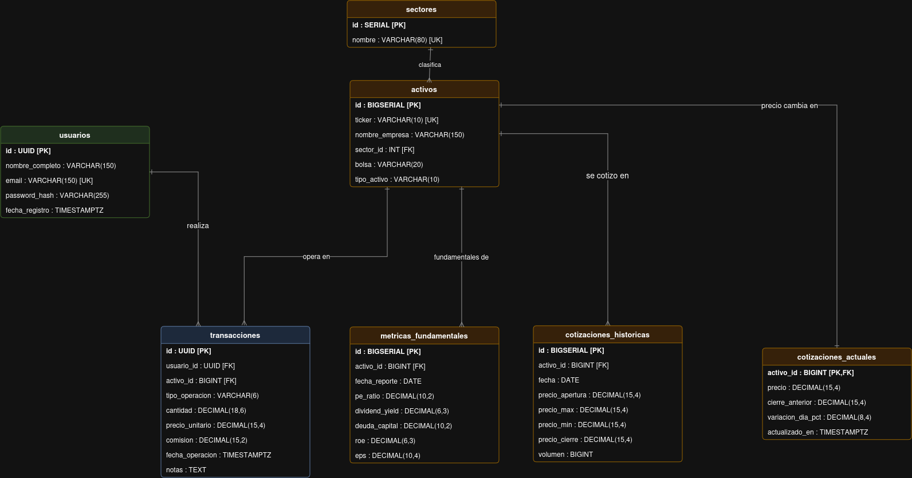

# ProgramacionWebTP
# TP2 - GoFolio

**Dominio elegido:** GoFolio, una aplicación web para registrar transacciones y gestionar un portafolio de inversiones.

## Entidades Principales del Dominio

Para representar el sistema, guardaremos la información estructurada en las siguientes entidades:

* **Usuarios:** Datos de la cuenta del inversor (ID, email, credenciales).
* **Activos:** Catálogo de instrumentos financieros operables (Ticker, nombre, tipo).
* **Sectores:** Clasificación de la industria para analizar la diversificación del portafolio (ej: Tecnología, Finanzas).
* **Transacciones:** Registro inmutable de compras y ventas (usuario, activo, cantidad, precio, fecha, tipo).
* **Cotizaciones Actuales:** Último precio de mercado conocido por cada activo.
* **Cotizaciones Históricas:** Serie de precios diarios (apertura, cierre, volumen) para graficar rendimientos.
* **Métricas Fundamentales:** Datos financieros trimestrales de las empresas (P/E Ratio, ROE, Deuda/Capital) para análisis.



---

## Modelo de Datos (Persistencia)

La capa de persistencia está construida sobre **PostgreSQL 15** y se diseñó priorizando la integridad de los datos financieros y el rendimiento de lectura.

### 1. Esquema Relacional
* `usuario`: Entidad principal de autenticación y dueña de los portafolios.
* `sector` y `activo`: Tablas de catálogo estático. Un sector agrupa múltiples activos (Relación 1:N).
* `transaccion`: Tabla transaccional central. Vincula a un `usuario` con un `activo` (Relación N:M).
* `cotizacion_actual`, `cotizacion_historica` y `metrica_fundamental`: Tablas satélite de mercado, fuertemente ligadas a la entidad `activo` mediante Foreign Keys.

### 2. Decisiones de Diseño y Arquitectura
* **Tipos de Datos Financieros:** Se descartó el uso de coma flotante (`FLOAT`/`REAL`) por sus problemas de redondeo. En su lugar, se utilizó **`DECIMAL/NUMERIC`** (ej. `DECIMAL(15,4)`) para garantizar precisión absoluta en precios, comisiones y balances.
* **Identificadores (PKs):** 
  * Se implementó **`UUID`** (vía `pgcrypto`) para las tablas `usuario` y `transaccion`. Esto evita ataques de enumeración (hacer predecible cuántos usuarios u operaciones tiene la plataforma).
  * Se utilizaron secuencias `BIGSERIAL` para tablas de alto volumen (`cotizacion_historica`) y `SERIAL` para catálogos pequeños (`sector`).
* **Integridad y Restricciones:** 
  * Uso de `ON DELETE CASCADE` para limpiar historiales si se elimina un activo.
  * Uso de `ON DELETE RESTRICT` en transacciones: es imposible eliminar un activo de la base de datos si ya existen usuarios que operaron con él.
  * Restricciones `CHECK` a nivel motor para evitar estados inválidos (ej: `tipo_operacion IN ('compra', 'venta')`).
* **Índices Estratégicos:** Se crearon índices B-Tree (`CREATE INDEX`) explícitos en todas las claves foráneas (ej: `usuario_id`, `activo_id`) para optimizar los JOINs.

### 3. Generación de Capa de Acceso a Datos
Para la interacción con la base de datos se implementó **`sqlc`**, el cual compila los archivos `queries.sql` y `schema.sql` para generar código Go.
Se respetan convenciones estrictas de operaciones CRUD (`:one`, `:many`, `:exec`), incluyendo el uso de cláusulas `ON CONFLICT DO UPDATE` (Upsert) para sincronizaciones eficientes de precios en `cotizacion_actual`.

---

## Cómo ejecutar el proyecto y los tests

La ejecución del entorno y las pruebas automatizadas se orquestan mediante Docker y un script de validación integral.

**Requisitos previos:**
* Tener `Docker` y `Docker Compose` instalados.
* Tener `Go` (1.22+) instalado localmente.
* Tener `sqlc` instalado

**Instrucciones:**

Clonacion del repositorio apuntando directamente a la rama de entrega y ejecucion del test:
   ```bash
   git clone -b tp2 --single-branch https://github.com/FranRamallo/ProgramacionWebTP.git
   cd ProgramacionWebTP
   cd TP2_DB
   make test
